# Courses Proposal Document Management System
This system was developed to digitize the university's curricular proposal process, transitioning the Registrar’s Office from a paper-based workflow to a streamlined digital pipeline. Built with Laravel and Nuxt.js, the application serves as a prototype for a new feature within the existing university portal. Beyond simple digitization, the platform provides a historical reference of course changes, enabling the academe to better understand and strengthen the university's curricula through data-driven insights.

## Tech Stack
- **Frontend**: Nuxt 3 (Vue 3), TypeScript, JavaScript
- **Backend**: Laravel 10, PHP
- **Database**: MySQL
- **Styling**: Tailwind CSS

## Screenshots				
			
<figure>
    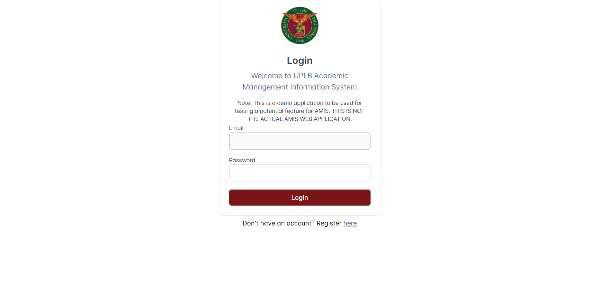
  <figcaption align="center"><i>Figure 1:</i> Login Page</figcaption>
</figure>

<figure>
    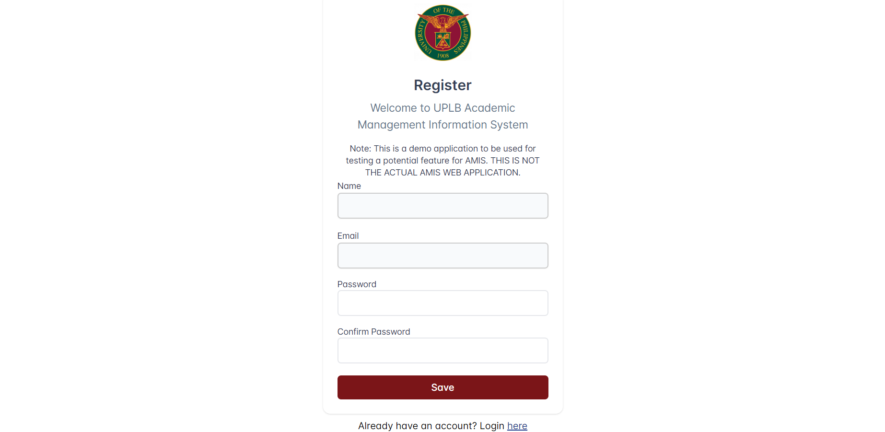
  <figcaption align="center"><i>Figure 2:</i> Register Page</figcaption>
</figure>

<figure>
    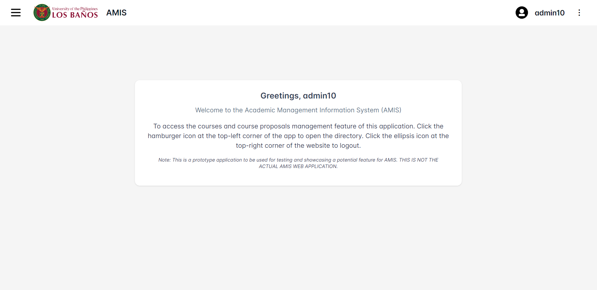
  <figcaption align="center"><i>Figure 3:</i> Home Page</figcaption>
</figure>

<figure>
    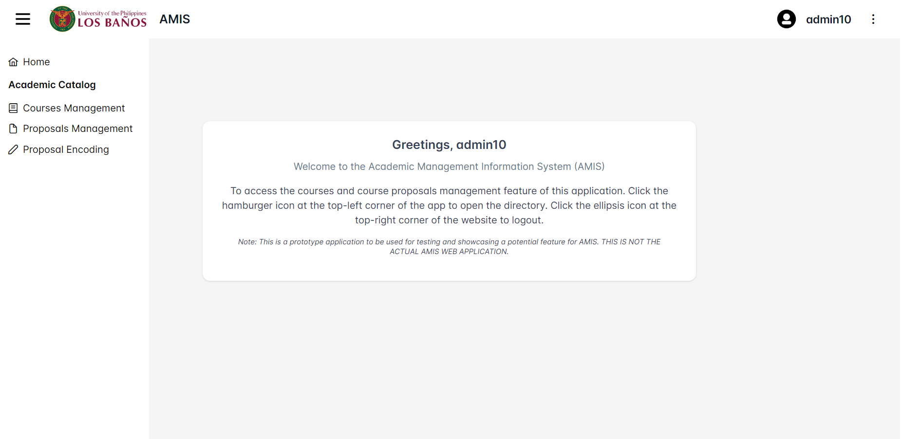
  <figcaption align="center"><i>Figure 4:</i> Navigation Drawer</figcaption>
</figure>

<figure>
    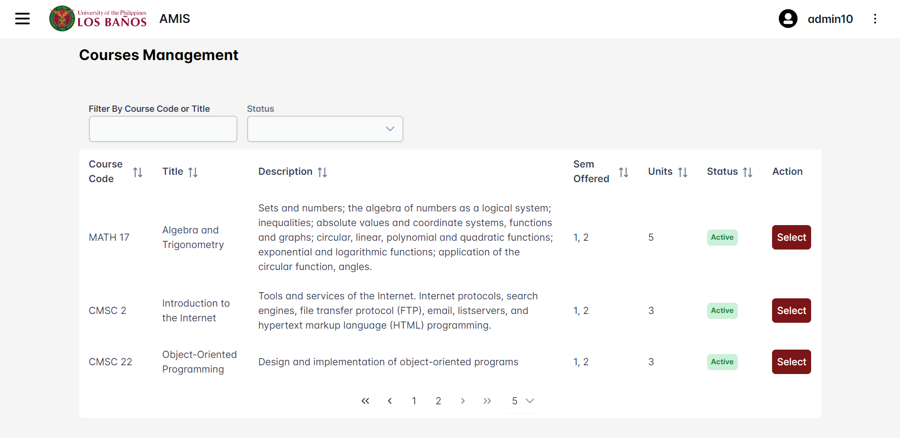
  <figcaption align="center"><i>Figure 5:</i> Courses Management Page</figcaption>
</figure>

<figure>
    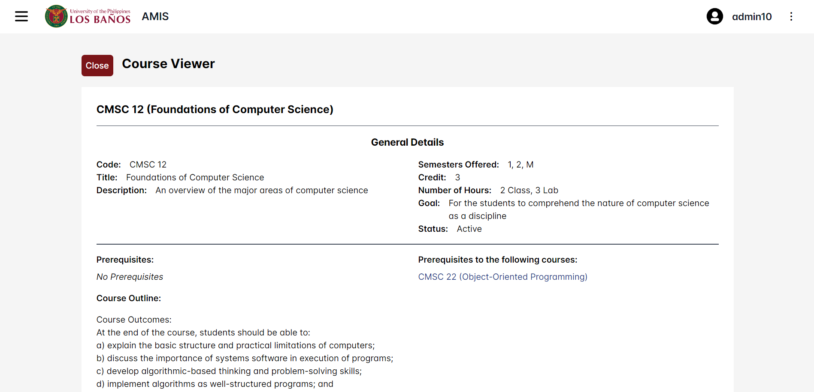
  <figcaption align="center"><i>Figure 6:</i> Course Viewer (General Details section)</figcaption>
</figure>

<figure>
    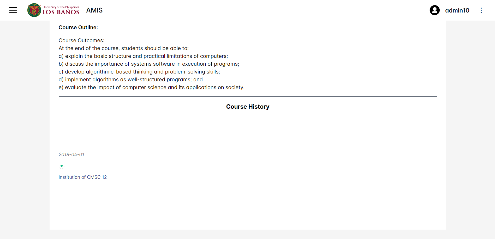
  <figcaption align="center"><i>Figure 7:</i> Course Viewer (Course History section)</figcaption>
</figure>

<figure>
    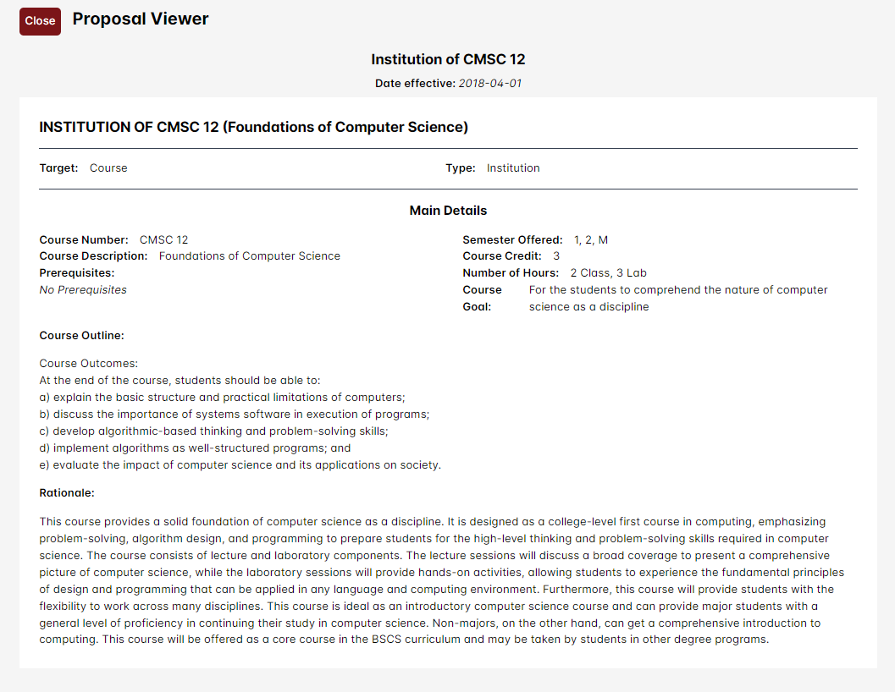
  <figcaption align="center"><i>Figure 8:</i> Proposal Viewer (Course Institution proposal)</figcaption>
</figure>

<figure>
    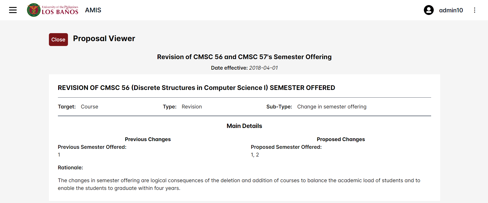
  <figcaption align="center"><i>Figure 9:</i> Proposal Viewer (Course Revision proposal)</figcaption>
</figure>

<figure>
    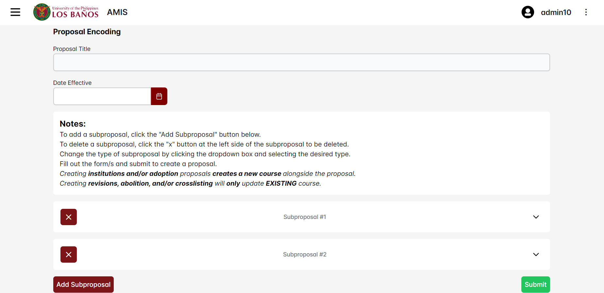
  <figcaption align="center"><i>Figure 10:</i> Proposal Encoding Page</figcaption>
</figure>

<figure>
    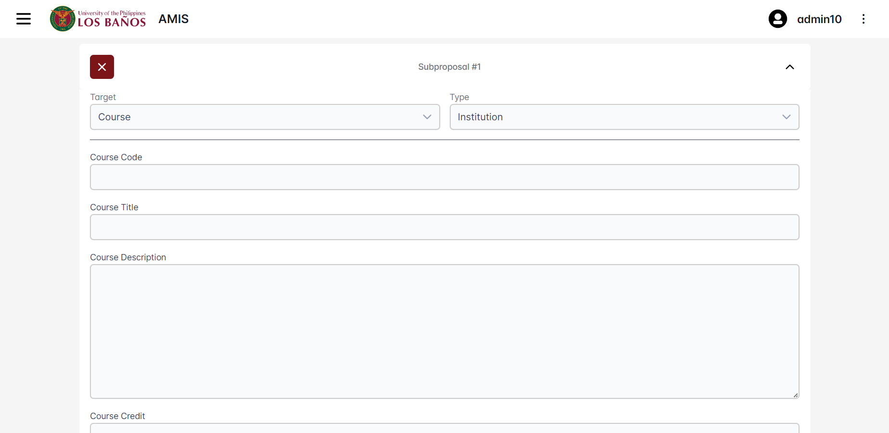
  <figcaption align="center"><i>Figure 11:</i> Proposal Encoding Page (Course Institution form)</figcaption>
</figure>

<figure>
    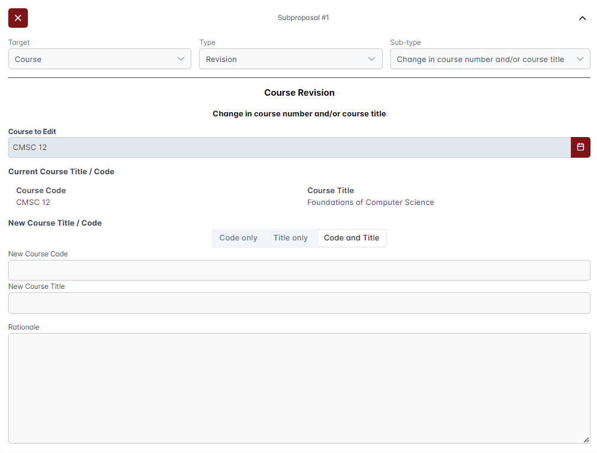
  <figcaption align="center"><i>Figure 12:</i> Proposal Encoding Page (Course Title and Code Revision form)</figcaption>
</figure>

<figure>
    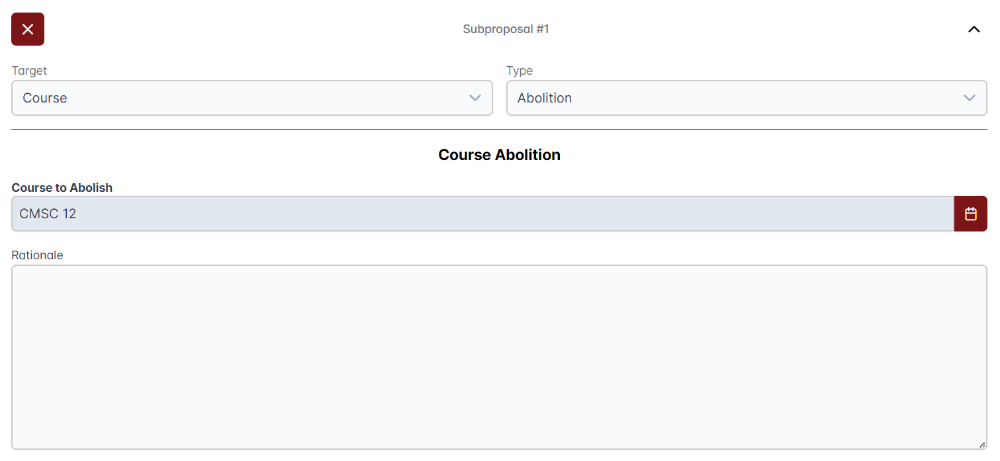
  <figcaption align="center"><i>Figure 13:</i> Proposal Encoding Page (Course Abolition form)</figcaption>
</figure>